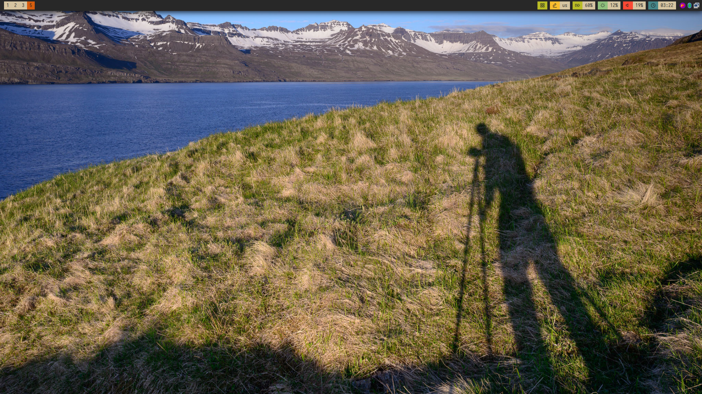

# dotefiles-bspwm
My bspwm config files
To use my dotefiles you have to install following packages:
1. ```sudo pacman -S bspwm sxhkd polybar pacman-contrib ttf-font-awesome siji-git```
2. Copy all the folder in the .config directory then you are good to to.


# Tips:
1. Enable touchpad Tap-to-click:
If you are a laptop user, you might want to enable tap to click so that it gets easier to navigate using a touchpad.
It is pretty easy to do so! Copy and paste this one command in your terminal to
fly!<br>
```bash
sudo mkdir -p /etc/X11/xorg.conf.d && sudo tee <<'EOF' /etc/X11/xorg.conf.d/90-touchpad.conf 1> /dev/null
Section "InputClass"
        Identifier "touchpad"
        MatchIsTouchpad "on"
        Driver "libinput"
        Option "Tapping" "on"
EndSection

EOF
```

# To enable touch screen on firefox
```bash
echo export MOZ_USE_XINPUT2=1 | sudo tee /etc/profile.d/use-xinput2.sh
```

# Fonts:
* Iosevka
* noto-fonts
* ttf-font-awesome
* icomoon-feather
