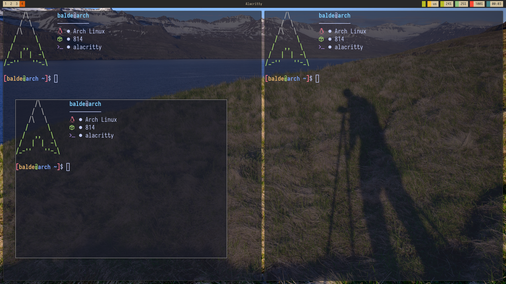

# dotefiles-bspwm
My bspwm config files
To use my dotefiles you have to install following packages:
1. ```sudo pacman -S bspwm sxhkd polybar pacman-contrib ttf-font-awesome siji-git```
2. Copy all the folder in the .config directory then you are good to to.


